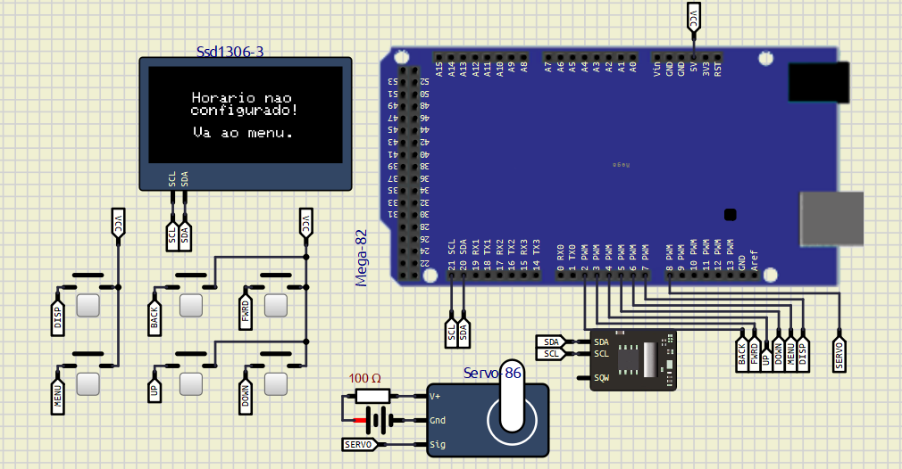
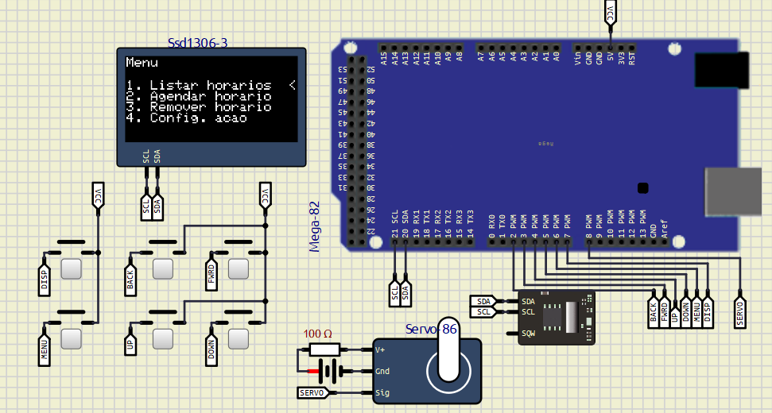
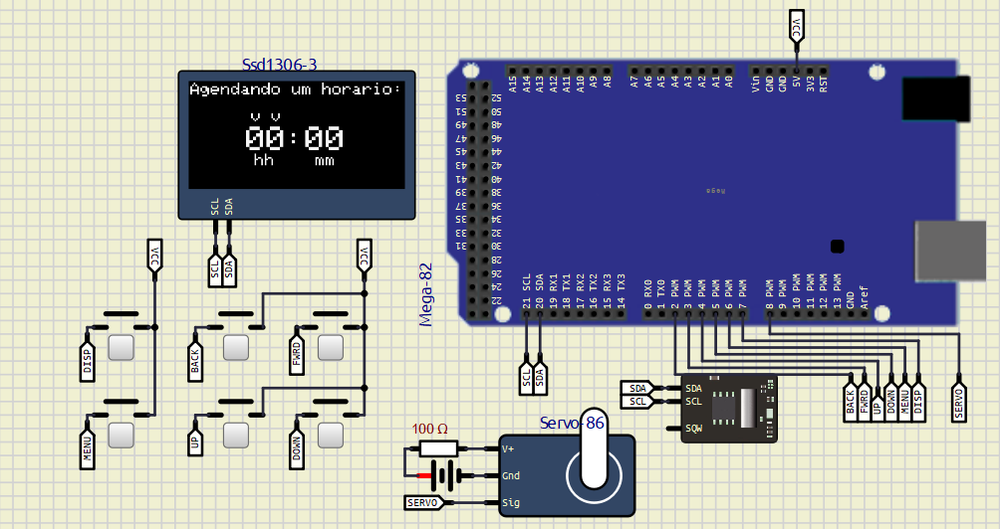
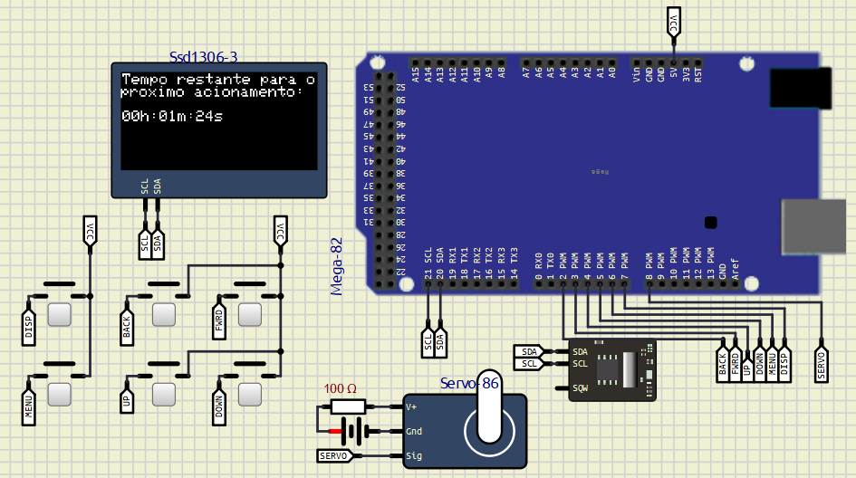
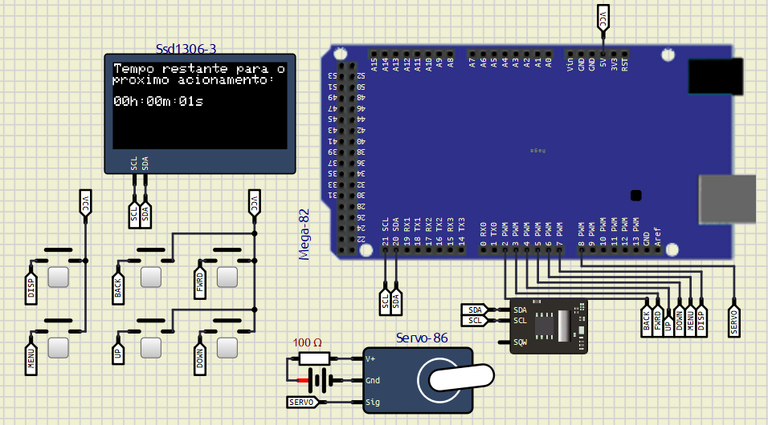

# Alimentador de PETs
Projeto final para conclusão da disciplina "Fundamentos de Sistemas Embarcados".

## 1. Proposta do projeto

A ideia é criar um alimentador de pets programável, no qual é possível indicar os horários de alimentação e a quantidade de tempo que a porta de vazão do alimentador ficará aberta, possibilitando dosar a quantidade de comida despejada.

## 2. Configurações

O código em questão foi contruído com base no seguinte setup:  
-  1 x Placa Arduino Mega;
-  1 x Display OLED Adafruit ssd1306;
-  1 x Módulo RTC DS1307;
-  6 x Botões;
-  1 x Resistor 100R;
-  1 x Bateria 5V;
-  1 x Motor Servo;

Simulador utilizado: [SimulIDE](https://simulide.com/p/)

## 3. Funcionamento

Ao iniciar o sistema pela primeira vez, verá a seguinte tela:

Como não há horários registrados na memória, é necessário configurar um primeiro.
Primeiramente, vamos ao menu através do botão MENU:

Agende um horário para a rotina de alimentação na opção 2. Aparecerá a seguinte tela:

Após o agendamento, será direcionado para a tela de apresentação do tempo restante para o próximo acionamento.

Caso queira remover algum agendamento, vá ao menu e escolha a opção 3. Aparecerá a tela:

Por fim, uma vez que o horário agendado mais próximo for atingido, a rotina de alimentação será iniciada e o mesmo horário reagendado para o próximo dia.

## 4. Observações

O sistema tem preservamento de memória e autoconfiguração, logo, as configurações do usuário permanecem após a reinicialização da placa, e caso não existam, serão configuradas automaticamente (se necessário).
Atentar também ao botão forward no simulador, que por algum motivo, costuma aparecer desconectado.
